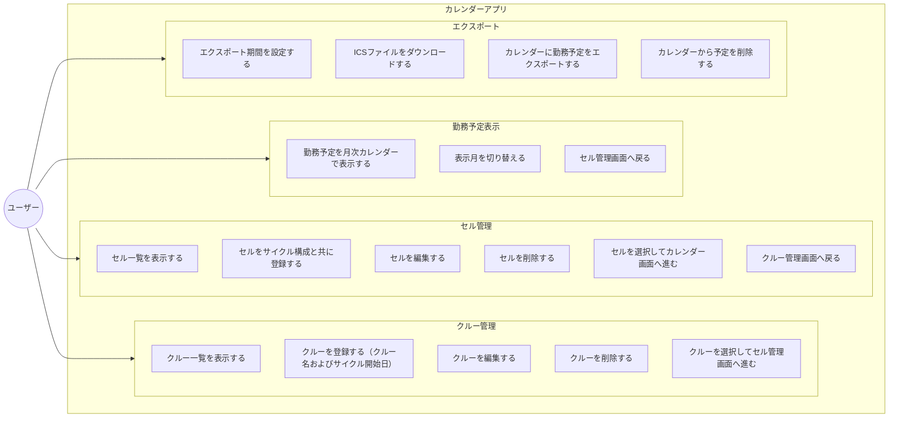

## ユースケース図

```mermaid
flowchart LR
    User((ユーザー))

    subgraph CalendarApp["カレンダーアプリ"]
        subgraph CrewManagement["クルー管理"]
            UC1_1[クルー一覧を表示する]
            UC1_2[クルーを登録する（クルー名およびサイクル開始日）]
            UC1_3[クルーを編集する]
            UC1_4[クルーを削除する]
            UC1_5[クルーを選択してセル管理画面へ進む]
        end

        subgraph CellManagement["セル管理"]
            UC2_1[セル一覧を表示する]
            UC2_2[セルをサイクル構成と共に登録する]
            UC2_3[セルを編集する]
            UC2_4[セルを削除する]
            UC2_5[セルを選択してカレンダー画面へ進む]
            UC2_6[クルー管理画面へ戻る]
        end

        subgraph ScheduleView["勤務予定表示"]
            UC3_1[勤務予定を月次カレンダーで表示する]
            UC3_2[表示月を切り替える]
            UC3_5[セル管理画面へ戻る]
        end

        subgraph Export["エクスポート"]
            UC4_1[エクスポート期間を設定する]
            UC4_2[ICSファイルをダウンロードする]
            UC4_3[カレンダーに勤務予定をエクスポートする]
            UC4_4[カレンダーから予定を削除する]
        end
    end

    User --> CrewManagement
    User --> CellManagement
    User --> ScheduleView
    User --> Export
```

---